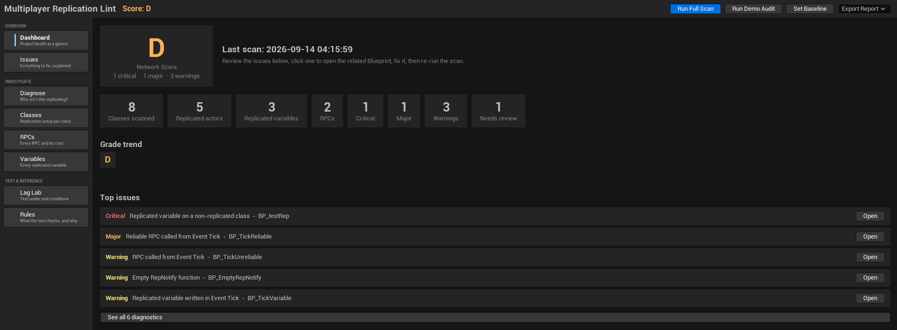
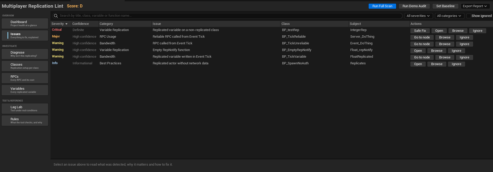
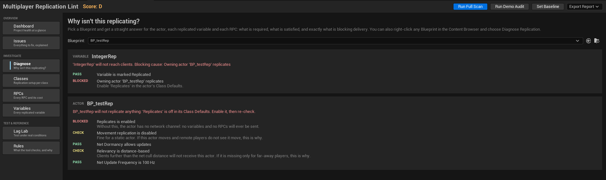
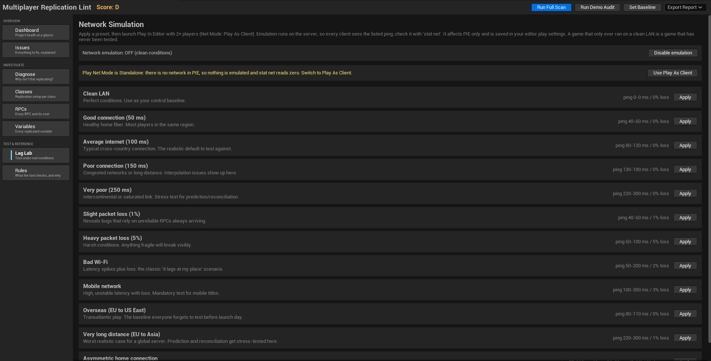
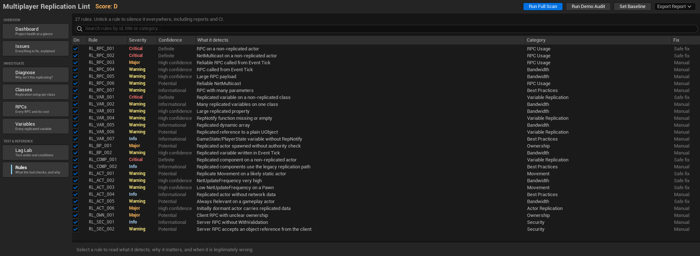
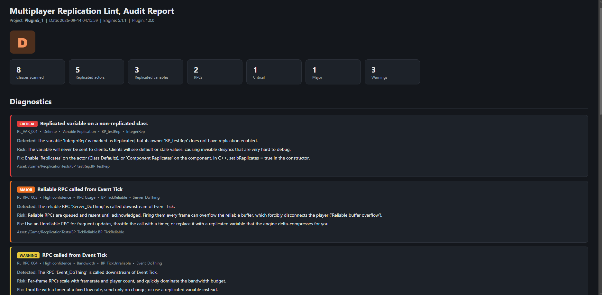
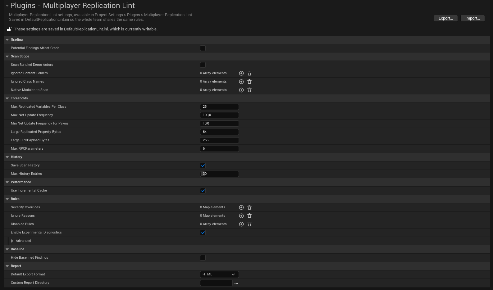

<div align="center">

<!-- PLACEHOLDER: logo du plugin, 128px de large -->


# Multiplayer Replication Lint

**Trouvez les erreurs de réplication de votre projet Unreal avant vos joueurs.**
*Blueprints et C++. Des explications claires. Une correction en un clic quand c'est sans risque.*

[]()
[]()
[](https://www.fab.com/sellers/Kybrien)
[](https://discord.gg/BwhyxQAAUn)

[English documentation](README.md) · **Français**

[Installation](#-installation) · [Démarrage rapide](#-démarrage-rapide) · [L'outil](#-loutil) · [Corrections](#-safe-fix-et-suggested-fix) · [Règles](#-les-27-règles) · [CI](#-intégration-continue) · [Dépannage](#-dépannage)

</div>

---

<!-- PLACEHOLDER: capture principale, la vue Issues après un scan avec un problème sélectionné et son explication visible -->


## Pourquoi ce plugin

Les bugs de réplication font rarement crasher quoi que ce soit. Une variable n'arrive jamais chez les
clients et ils gardent la valeur du spawn. Un RPC part dans le vide parce que l'acteur ne réplique pas.
Un appel reliable part à chaque frame jusqu'à ce que le serveur éjecte le joueur. Sur votre machine
tout marche, et tout casse à la première vraie session.

Unreal a de bons outils pour mesurer une session déjà en cours. Aucun ne lit votre projet pour vous
dire ce qui est faux avant d'appuyer sur Play.

|  | Multiplayer Replication Lint | Network Profiler / Networking Insights |
|---|:---:|:---:|
| **Trouve les erreurs sans lancer le jeu** | Oui | Non, il faut une session |
| **Lit les graphes Blueprint** (chaînes Tick, spawns, RepNotify) | Oui | Non |
| **Explique pourquoi ça casse et comment corriger** | Oui | Non |
| **Correction en un clic des erreurs de configuration** | Oui | Non |
| **Fait échouer un build CI sur un nouveau problème critique** | Oui | Non |
| **Reproduit de mauvaises conditions réseau à la demande** | Oui | Non |
| **Mesure les octets qu'une session envoie réellement** | Non | Oui |

> Utilisez les deux. Multiplayer Replication Lint attrape les erreurs de configuration, et le profiler
> vous dit ce que votre jeu coûte sur le réseau une fois qu'il tourne.

*Dans cette documentation, les boutons et les menus sont nommés en anglais. Si votre éditeur est en
français, l'interface du plugin les affiche en français.*

---

## 📦 Installation

### 1. Installer

Copiez le dossier `MultiplayerReplicationLint` dans le dossier `Plugins/` de votre projet, relancez
l'éditeur et acceptez la compilation.

Vérifiez dans **Edit → Plugins** que *Multiplayer Replication Lint* est bien activé.

### 2. Ouvrir l'outil

**Tools → Multiplayer Replication Lint**. La fenêtre est un onglet d'éditeur classique, vous pouvez la docker où vous
voulez.

<!-- PLACEHOLDER: capture du menu Tools avec l'entrée mise en évidence -->


### 3. Lui indiquer votre C++ (optionnel)

Les Blueprints sous `/Game` sont toujours scannés. Les classes C++ ne le sont que pour les modules que
vous listez.

**Edit → Project Settings → Plugins → Multiplayer Replication Lint → Native Modules To Scan**, ajoutez le nom de votre
module de jeu (par exemple `MyGame`).

> [!NOTE]
> Le scan C++ lit les données de réflexion : les flags `UPROPERTY` et `UFUNCTION`, les réglages de
> réplication, les valeurs par défaut de la classe. Il ne lit **pas** le corps des fonctions. Un
> `Tick()` C++ qui appelle un RPC à chaque frame lui est invisible.

---

## 🚀 Démarrage rapide

1. Ouvrez **Tools → Multiplayer Replication Lint**
2. Cliquez sur **Run Full Scan**. Une fenêtre de progression parcourt le projet. Vous pouvez annuler à
   tout moment et garder ce qui a déjà été trouvé.
3. Regardez votre note, de **A** à **E**, sur le Dashboard
4. Ouvrez **Issues** et commencez par les lignes rouges
5. Sélectionnez une ligne. Le panneau du bas explique ce qui a été détecté, pourquoi ça casse en vraie
   partie, et comment le corriger
6. Cliquez sur **Open** pour ouvrir le Blueprint, ou sur **Fix** quand le bouton est là
7. Sauvegardez, relancez le scan, regardez la note monter

Sur un projet propre, le premier scan peut très bien revenir vide, et c'est la réponse que vous
voulez. Pour voir ce que l'outil détecte, cliquez sur **Run Demo Audit** : il scanne quatre acteurs C++
cassés exprès, une seule fois, sans les mélanger à vos propres résultats.

<!-- PLACEHOLDER: courte vidéo GIF, Run Full Scan puis la note qui apparaît sur le Dashboard -->


---

## 🧭 L'outil

Huit vues, regroupées dans la navigation de gauche. Chaque entrée a une petite description en dessous.

### Dashboard

L'état du projet en un coup d'œil.

- **La note**, de A à E, en couleur
- **Des tuiles de statistiques** : classes scannées, acteurs, variables et RPC répliqués, problèmes par
  sévérité
- **L'évolution de la note** sur vos 12 derniers scans complets
- **Depuis le dernier scan** : ce qui est nouveau et ce qui a été corrigé
- **Les 5 principaux problèmes**, chacun avec un bouton Open

Avant le premier scan, il affiche un guide en trois étapes.

<!-- PLACEHOLDER: capture du Dashboard avec quelques scans d'historique -->


### Issues

Tous les problèmes dans un seul tableau triable. C'est là que vous passerez votre temps.

- **Filtrez** par texte, sévérité et catégorie. Cochez *Show ignored* pour revoir ce que vous avez
  écarté
- **Sélectionnez une ligne** pour lire l'explication : *ce qui a été détecté*, *le risque en vraie
  partie*, *la correction recommandée*, et l'identifiant de la règle
- **Open** ouvre le Blueprint, **Browse** le sélectionne dans le Content Browser
- **Safe Fix** ou **Suggested Fix** apparaît sur les problèmes que l'outil peut corriger, voir [Corrections](#-safe-fix-et-suggested-fix)
- **Ignore** masque un problème que vous avez décidé de garder. Il sort de la note et des rapports
- **Tout ignorer dans une catégorie ou sur une classe** depuis le panneau de détails, réversible avec
  *Show ignored*

Un double clic sur une ligne ouvre l'asset.

<!-- PLACEHOLDER: vue Issues avec un problème Critical sélectionné et le panneau d'explication visible -->


### Diagnose

*« Pourquoi ça ne réplique pas ? »*, avec une vraie réponse.

Choisissez un Blueprint. Vous obtenez un diagnostic pour l'acteur, pour chacune de ses variables
répliquées et pour chacun de ses RPC : les conditions nécessaires pour que ça arrive chez les clients,
celles qui sont remplies, et un verdict qui nomme clairement ce qui bloque.

| Il vérifie | Par exemple |
|---|---|
| L'acteur réplique | *Replicates est décoché dans les Class Defaults : rien ne sera jamais envoyé* |
| La dormance | *Net Dormancy est sur Initial : réplique une fois au spawn, puis s'arrête* |
| La pertinence | *Basée sur la distance : les joueurs éloignés ne le recevront pas* |
| La variable est marquée Replicated | et son composant parent réplique aussi |
| La fonction RepNotify existe | |
| Le sens et la fiabilité du RPC | *Unreliable : peut être perdu en cas de perte de paquets* |
| L'ownership | *Pawns, PlayerControllers et PlayerStates ont toujours un propriétaire* |

**Raccourci :** clic droit sur n'importe quel Blueprint dans le Content Browser → **Diagnose
Replication**.

<!-- PLACEHOLDER: vue Diagnose avec un verdict BLOCKED sur une variable -->


### Classes, RPCs, Variables

Trois vues d'inventaire, chacune avec sa recherche et un bouton Open.

| Vue | Une ligne par | Affiche |
|---|---|---|
| **Classes** | classe | Replicates, mouvement, fréquence de mise à jour, nombre de variables, de RPC et de problèmes |
| **RPCs** | RPC | Server / Client / Multicast, reliable, validation, taille estimée, appelé depuis Tick |
| **Variables** | variable répliquée | Type, RepNotify, taille estimée, de la plus grosse à la plus petite |

### Lag Lab

Testez votre jeu dans de vraies conditions réseau, en un clic.

1. Choisissez un preset et cliquez sur **Apply**
2. Lancez Play In Editor avec au moins 2 joueurs, Net Mode **Play As Client**
3. Jouez. Tapez `stat net` dans une fenêtre client pour voir le ping

| Preset | Ping | Perte |
|---|:---:|:---:|
| Clean LAN | 0 | 0 % |
| Good connection | 40 à 60 ms | 0 % |
| Average internet | 80 à 120 ms | 0 % |
| Poor connection | 130 à 180 ms | 0 % |
| Very poor | 220 à 300 ms | 0 % |
| Slight packet loss | 40 à 60 ms | 1 % |
| Heavy packet loss | 60 à 100 ms | 5 % |
| Bad Wi-Fi | 50 à 200 ms | 2 % |
| Mobile network | 100 à 350 ms | 3 % |
| Overseas (EU to US East) | 80 à 110 ms | 0 % |
| Very long distance (EU to Asia) | 220 à 300 ms | 1 % |
| Asymmetric home connection | 57 à 102 ms | 2 % en upload seulement |

Le ping indiqué est celui que `stat net` devrait afficher, pas un délai par paquet. L'émulation tourne
sur le serveur, donc tous les clients ont les mêmes conditions.

> [!NOTE]
> **Le Lag Lab crée des conditions, il ne mesure rien.** Il configure l'émulation réseau du PIE à votre
> place, pour qu'un test réaliste tienne en un clic au lieu de six champs dans les Editor Preferences.
> La mesure reste le travail de `stat net` ou de Networking Insights, et c'est pour ça que le tableau
> en haut de cette page dit que le plugin ne mesure pas la bande passante.

> [!TIP]
> **Le preset asymétrique est le plus intéressant.** Le téléchargement est rapide, l'envoi est lent et
> perd des paquets, comme une connexion domestique saturée. Votre personnage a l'air normal pour les
> autres, mais vos propres actions arrivent en retard. Un test symétrique ne montre jamais ça.

**Disable emulation** remet tout en conditions propres. Les réglages sont écrits dans vos paramètres
de Play de l'éditeur, au même endroit que **Editor Preferences → Play → Network Emulation**.

<!-- PLACEHOLDER: vue Lag Lab avec un preset appliqué et la ligne d'état visible -->


### Rules

Toutes les règles vérifiées par l'outil, avec trois courts paragraphes chacune : ce qu'elle détecte,
pourquoi c'est important, et quand elle a tort pour de bonnes raisons. Décochez une règle ici pour
qu'elle ne signale plus rien.

<!-- PLACEHOLDER: vue Rules avec une règle sélectionnée -->


---

## 🩹 Safe Fix et Suggested Fix

Huit règles proposent un bouton de correction dans la vue Issues. Toutes les corrections sont aussi
sûres mécaniquement : une valeur de Class Defaults, une transaction, annulable, aucun graphe touché.
Le libellé dit ce que l'outil prétend savoir de votre intention.

**Safe Fix** (RL_VAR_001, RL_RPC_001, RL_RPC_002, RL_COMP_001) : la configuration ne peut pas marcher
et il n'y a qu'une valeur correcte.

**Suggested Fix** (RL_ACT_001, RL_ACT_002, RL_ACT_003, RL_ACT_005) : une heuristique l'a signalé, et
la valeur actuelle était peut-être volontaire. La fenêtre de confirmation le précise.

| Règle | Correction |
|---|---|
| `RL_VAR_001` Variable répliquée sur une classe non répliquée | Active **Replicates** |
| `RL_RPC_001` RPC sur un acteur non répliqué | Active **Replicates** |
| `RL_RPC_002` NetMulticast sur un acteur non répliqué | Active **Replicates** |
| `RL_COMP_001` Composant répliqué sur un acteur non répliqué | Active **Replicates** |
| `RL_ACT_001` Replicate Movement sur un acteur probablement statique | Désactive **Replicate Movement** |
| `RL_ACT_005` Always Relevant sur un acteur de gameplay | Désactive **Always Relevant** |
| `RL_ACT_002` NetUpdateFrequency très élevée | La règle sur votre maximum configuré |
| `RL_ACT_003` NetUpdateFrequency basse sur un Pawn | La règle sur votre minimum configuré pour les Pawns |

**Ce qu'une correction ne fera jamais :**

- **Toucher un graphe.** Elle change une seule valeur des Class Defaults, exactement comme un clic dans
  le panneau Details. Aucun node n'est ajouté, déplacé ou modifié.
- **Toucher au C++.** Les problèmes sur des classes C++ n'ont pas de bouton Fix.
- **Sauvegarder à votre place.** Le Blueprint est marqué comme modifié. Vous vérifiez et vous
  sauvegardez vous-même.
- **Vous surprendre.** Une fenêtre décrit le changement exact avant que quoi que ce soit ne se passe.

Les acteurs déjà placés dans vos niveaux ouverts suivent aussi la nouvelle valeur, tant qu'ils
utilisaient encore celle par défaut. Un acteur sur lequel vous aviez volontairement changé la valeur
n'est pas touché.

> [!IMPORTANT]
> **Annulez avant de compiler.** `Ctrl+Z` annule une correction, sur le Blueprint et sur les acteurs
> placés. Une fois le Blueprint compilé, l'annulation ne ramène plus l'ancienne valeur. Si vous
> changez d'avis après une compilation, remettez la valeur à la main dans les Class Defaults.

Tout le reste n'est volontairement pas corrigeable automatiquement. Sortir un RPC du Tick ou ajouter
une vérification d'autorité est une décision de design, et un outil qui devine le design, c'est
comme ça qu'on se retrouve avec un deuxième bug.

---

## 📋 Les 27 règles

La **sévérité** dit à quel point c'est grave. La **confiance** dit à quel point l'outil en est sûr.

| Sévérité | Signification |
|---|---|
| **Critical** | La réplication est cassée. Quelque chose n'arrivera pas chez les clients. |
| **Major** | Marche sur votre machine, échoue en vraie session. Déconnexions, désynchronisations. |
| **Warning** | Consomme de la bande passante ou du CPU pour rien, ou c'est fragile. |
| **Info** | Bon à savoir. Rien n'est cassé. |

| Confiance | Signification |
|---|---|
| **Definite** | Prouvable à partir de la configuration de la classe. Si ça sort, c'est réel. |
| **High confidence** | Presque toujours juste. Un limiteur que l'outil ne voit pas est l'exception habituelle. |
| **Potential** | Une heuristique. Lisez l'explication avant d'agir. |
| **Informational** | Un signal plutôt qu'un défaut. |

Les règles marquées *expérimentales* sont des heuristiques qui peuvent donner des faux positifs, c'est
voulu. Désactivez-les toutes d'un coup avec **Enable Experimental Diagnostics** dans les Project
Settings.

<details>
<summary><b>▸ RPC, 7 règles</b></summary>

<br/>

| ID | Règle | Sévérité | Confiance | Fix |
|---|---|:---:|:---:|:---:|
| `RL_RPC_001` | RPC sur un acteur non répliqué | Critical | Definite | ✅ |
| `RL_RPC_002` | NetMulticast sur un acteur non répliqué | Critical | Definite | ✅ |
| `RL_RPC_003` | RPC reliable appelé depuis Event Tick | Major | High | |
| `RL_RPC_004` | RPC appelé depuis Event Tick | Warning | High | |
| `RL_RPC_005` | Charge utile de RPC trop grosse | Warning | High | |
| `RL_RPC_006` | NetMulticast reliable *(expérimentale)* | Warning | Potential | |
| `RL_RPC_007` | RPC avec beaucoup de paramètres | Warning | Informational | |

</details>

<details>
<summary><b>▸ Variables, 7 règles</b></summary>

<br/>

| ID | Règle | Sévérité | Confiance | Fix |
|---|---|:---:|:---:|:---:|
| `RL_VAR_001` | Variable répliquée sur une classe non répliquée | Critical | Definite | ✅ |
| `RL_VAR_002` | Beaucoup de variables répliquées sur une classe | Warning | Informational | |
| `RL_VAR_003` | Propriété répliquée volumineuse | Warning | High | |
| `RL_VAR_004` | Fonction RepNotify manquante ou vide | Warning | High | |
| `RL_VAR_005` | Tableau dynamique répliqué | Warning | Informational | |
| `RL_VAR_006` | Référence répliquée vers un simple UObject *(expérimentale)* | Warning | Potential | |
| `RL_VAR_007` | Variable de GameState ou PlayerState sans RepNotify *(expérimentale)* | Info | Informational | |

</details>

<details>
<summary><b>▸ Logique Blueprint, 2 règles</b></summary>

<br/>

| ID | Règle | Sévérité | Confiance | Fix |
|---|---|:---:|:---:|:---:|
| `RL_BP_001` | Acteur répliqué spawné sans vérification d'autorité *(expérimentale)* | Major | Potential | |
| `RL_BP_002` | Variable répliquée écrite dans Event Tick | Warning | High | |

</details>

<details>
<summary><b>▸ Composants, 2 règles</b></summary>

<br/>

| ID | Règle | Sévérité | Confiance | Fix |
|---|---|:---:|:---:|:---:|
| `RL_COMP_001` | Composant répliqué sur un acteur non répliqué | Critical | Definite | ✅ |
| `RL_COMP_002` | Composants répliqués sur l'ancien système de réplication *(expérimentale)* | Info | Informational | |

</details>

<details>
<summary><b>▸ Réglages d'acteur, 6 règles</b></summary>

<br/>

| ID | Règle | Sévérité | Confiance | Fix |
|---|---|:---:|:---:|:---:|
| `RL_ACT_001` | Replicate Movement sur un acteur probablement statique *(expérimentale)* | Warning | Potential | ✅ |
| `RL_ACT_002` | NetUpdateFrequency très élevée | Warning | High | ✅ |
| `RL_ACT_003` | NetUpdateFrequency basse sur un Pawn | Warning | High | ✅ |
| `RL_ACT_004` | Acteur répliqué sans aucune donnée réseau *(expérimentale)* | Info | Informational | |
| `RL_ACT_005` | Always Relevant sur un acteur de gameplay *(expérimentale)* | Warning | Potential | ✅ |
| `RL_ACT_006` | Acteur dormant au départ qui porte des données répliquées | Major | High | |

</details>

<details>
<summary><b>▸ Ownership et sécurité, 3 règles</b></summary>

<br/>

| ID | Règle | Sévérité | Confiance | Fix |
|---|---|:---:|:---:|:---:|
| `RL_OWN_001` | RPC client avec un ownership incertain *(expérimentale)* | Major | Potential | |
| `RL_SEC_001` | RPC serveur sans WithValidation *(expérimentale)* | Info | Informational | |
| `RL_SEC_002` | RPC serveur qui accepte une référence d'objet venant du client *(expérimentale)* | Warning | Potential | |

</details>

L'explication complète de chaque règle, y compris les cas où elle a tort, se trouve dans la vue
**Rules** de l'éditeur.

> [!NOTE]
> **Cinq règles n'existent que pour les Blueprints.** `RL_RPC_003`, `RL_RPC_004`, `RL_BP_001` et
> `RL_BP_002` suivent la chaîne d'exécution d'Event Tick, qui n'existe que dans un graphe Blueprint.
> `RL_VAR_004` doit voir le contenu de la fonction RepNotify, et le corps des fonctions C++ n'est pas
> lu.

---

## 📊 Note, baseline et historique

### Comment la note est calculée

Seuls les problèmes confirmés comptent, c'est-à-dire de confiance Definite ou High. Les heuristiques
apparaissent sous **Needs review** sur le Dashboard et ne font jamais bouger la note, sauf si vous
cochez *Potential Findings Affect Grade*.

| Note | Quand |
|:---:|---|
| **A** | Aucun Critical, aucun Major, aucun Warning |
| **B** | Seulement des Warnings |
| **C** | 1 ou 2 Major, aucun Critical |
| **D** | 1 ou 2 Critical, ou 3 Major et plus |
| **E** | 3 Critical et plus |

Les problèmes Info et les problèmes ignorés ne comptent jamais.

### Baseline

Sur un vrai projet, le premier scan peut sortir une centaine de problèmes. Vous n'allez pas tout
corriger aujourd'hui, et une liste qui ne raccourcit jamais, personne ne la lit.

**Set Baseline** fige les problèmes actuels comme votre dette acceptée. À partir de là, le Dashboard
vous dit ce qui est **nouveau** depuis ce moment et ce qui a été **corrigé**. La question du quotidien
devient *« est-ce que je viens d'ajouter un problème ? »*, et c'est une question sur laquelle on agit
vraiment.

- **Update Baseline** la remplace par les problèmes actuels
- **Clear Baseline** la supprime, et tous les problèmes sont de nouveau signalés
- Cochez **Hide Baselined Findings** dans les Project Settings pour ne garder que les nouveaux dans la
  vue Issues

La baseline est enregistrée dans `Config/ReplicationLint/`, vous pouvez donc la commit et la
partager avec votre équipe.

> [!NOTE]
> La baseline est une fonctionnalité de l'éditeur. Le commandlet de CI filtre sur la sévérité, la note
> et le nombre de problèmes, il ne lit pas la baseline.

### Historique

Chaque scan complet est enregistré dans `Saved/ReplicationLint/History/`. C'est ce qui alimente
l'évolution de la note et le *depuis le dernier scan*. Un scan de dossier est partiel, il est donc
volontairement tenu à l'écart de l'historique : sinon tout ce qui est hors du dossier apparaîtrait
comme *corrigé*.

---

## 🙈 Ignorer des problèmes

Certains problèmes sont voulus. Un GameState avec 40 variables répliquées est un point central de
données, pas une erreur.

- **Ignore** sur une ligne masque ce problème précis
- **Tout ignorer dans une catégorie** ou **sur une classe** depuis le panneau de détails
- **Show ignored** les fait réapparaître, avec **Restore** sur chacun

Les problèmes ignorés sortent de la note, des rapports et des contrôles de CI. La liste est stockée
dans la config du projet, donc toute l'équipe et la machine de build sont d'accord sur ce qui a été
accepté.

Pour écarter des zones entières, utilisez plutôt **Ignored Content Folders** et **Ignored Class
Names** dans les Project Settings.

---

## 📄 Rapports

**Export Report** dans la barre du haut, après un scan.

| Format | Idéal pour |
|---|---|
| **HTML** | L'envoyer à l'équipe, le joindre à une milestone |
| **Markdown** | GitHub, wikis, pull requests |
| **JSON** | La CI et vos propres outils |
| **CSV** | Excel, Google Sheets, outils de suivi de bugs |

Les rapports vont dans `Saved/ReplicationLint/Reports/` et le dossier s'ouvre tout seul. Changez-le
avec **Custom Report Directory** dans les Project Settings.

<!-- PLACEHOLDER: capture d'un rapport HTML ouvert dans un navigateur -->


**Scanner un seul dossier :** clic droit sur un dossier dans le Content Browser → **Scan with
Multiplayer Replication Lint**.

---

## 🤖 Intégration continue

Un commandlet lance le même scan sans interface, pour qu'une pull request qui ajoute un bug de
réplication critique échoue comme un test unitaire qui échoue.

```
UnrealEditor-Cmd.exe MyProject.uproject -run=ReplicationLintScan ^
  -FailOn=critical -Format=json+html -unattended -nopause -nosplash
```

| Option | Par défaut | Rôle |
|---|---|---|
| `-Paths=/Game/A+/Game/B` | `/Game` | Dossiers à scanner, séparés par `+` |
| `-Format=json+html` | `json` | Formats de rapport : `html`, `md`, `json`, `csv` |
| `-FailOn=critical` | `critical` | Échoue si un problème de cette sévérité ou plus existe. `none` le désactive |
| `-MinGrade=C` | *désactivé* | Échoue si la note est moins bonne que cette lettre |
| `-MaxIssues=20` | *désactivé* | Échoue au-delà de ce nombre de problèmes |
| `-MinConfidence=definite` | *désactivé* | Seuls les problèmes de cette confiance ou plus peuvent faire échouer le build |
| `-NoCache` | *désactivé* | Vide le cache d'abord, pour un scan à froid reproductible |

| Code de sortie | Signification |
|:---:|---|
| `0` | Tous les contrôles sont passés |
| `1` | Un contrôle a échoué. C'est ce que votre pipeline doit traiter. |
| `2` | Le scan n'a pas pu tourner : argument invalide, pas de résultat |

<details>
<summary><b>▸ Commencer souple, puis serrer la vis</b></summary>

<br/>

Faire échouer le build dès le premier jour sur un projet existant apprend surtout à tout le monde à
ignorer le contrôle.

```
Semaine 1   -FailOn=none                                    rapport seulement
Semaine 2   -FailOn=critical -MinConfidence=definite        bloquer ce qui est prouvable
Ensuite     -FailOn=major -MaxIssues=15 -MinGrade=B         resserrer petit à petit
```

</details>

<details>
<summary><b>▸ GitHub Actions</b></summary>

<br/>

```yaml
name: Replication audit

on: [pull_request]

jobs:
  replication-audit:
    runs-on: [self-hosted, unreal]   # nécessite une installation du moteur
    steps:
      - uses: actions/checkout@v4

      - name: Run Multiplayer Replication Lint
        shell: pwsh
        run: |
          & "$env:UE_ROOT\Engine\Binaries\Win64\UnrealEditor-Cmd.exe" `
            "${{ github.workspace }}\MyProject.uproject" `
            -run=ReplicationLintScan `
            -Format=json+html `
            -FailOn=critical `
            -unattended -nopause -nosplash

      - name: Upload report
        if: always()
        uses: actions/upload-artifact@v4
        with:
          name: replication-report
          path: Saved/ReplicationLint/Reports/
```

`if: always()` est important : c'est justement quand le contrôle échoue que vous voulez le rapport.

</details>

---

## 🍳 Recettes

### Votre première passe sur un projet existant

Le premier scan d'un projet jamais audité est long. N'essayez pas de tout corriger d'un coup.

1. **Run Full Scan**, puis triez Issues par sévérité
2. **Corrigez les Critical.** Ils sont prouvables : quelque chose que vous avez écrit n'arrivera
   jamais chez les clients. La plupart ont un bouton Safe Fix
3. **Lisez les Major**, un par un. Chacun est un vrai bug en vraie partie, et la plupart demandent une
   décision de design
4. **Set Baseline.** Tout ce qui reste devient de la dette acceptée
5. À partir de là, le Dashboard répond à la seule question qui compte au quotidien : *est-ce que je
   viens d'ajouter un problème ?*

### Le brancher sur vos pull requests

En trois étapes espacées de plusieurs semaines, pas d'un coup.

| Quand | Commande | Effet |
|---|---|---|
| Semaine 1 | `-FailOn=none` | Rien ne bloque. Tout le monde voit les alertes et s'y habitue |
| Semaine 2 | `-FailOn=critical -MinConfidence=definite -NewOnly` | Seuls les problèmes prouvables et nouveaux bloquent |
| Ensuite | `-FailOn=major -MinGrade=B` | On resserre à mesure que la dette diminue |

Faire échouer tous les builds dès le premier jour sur un projet existant apprend surtout à l'équipe à
désactiver le contrôle.

### Régler les seuils plutôt qu'ignorer les problèmes

Si une règle se déclenche sans arrêt et que vous cliquez Ignore à chaque fois, c'est le seuil qui est
mauvais pour votre jeu, pas le problème.

- Un shooter compétitif fait légitimement tourner les pawns au-dessus de 100 Hz. Augmentez **Max Net
  Update Frequency** au lieu d'ignorer `RL_ACT_002` quarante fois
- Un GameState est un point central de données et portera beaucoup de variables répliquées. Augmentez
  **Max Replicated Variables Per Class**
- Un dossier tiers entier qui ne vous appartient pas va dans **Ignored Content Folders**, pas dans la
  liste des ignores un problème à la fois

Ignore sert pour l'exception. Les réglages servent pour la règle.

### Comprendre pourquoi un acteur précis ne réplique pas

Plus rapide que de lire toute la liste Issues quand vous savez déjà quel Blueprint fait n'importe quoi.

1. Clic droit sur le Blueprint dans le Content Browser → **Diagnose Replication**
2. Lisez d'abord le bloc ACTOR. S'il est BLOCKED, rien en dessous n'a d'importance
3. Puis le bloc de la variable ou du RPC qui vous intéresse
4. Les lignes marquées **CHECK** sont des conditions que l'outil ne peut pas vérifier statiquement,
   l'ownership par exemple. C'est la réponse habituelle quand tout est PASS et que ça ne marche
   toujours pas

### Donner un rapport à quelqu'un qui n'utilise pas Unreal

Exportez en **HTML**. Ça s'ouvre dans n'importe quel navigateur, ça contient toutes les explications,
et ça ne demande ni plugin, ni moteur, ni contexte. C'est le bon format pour un producteur, un client
ou une revue de jalon.

Exportez plutôt en **CSV** s'ils vont transformer les problèmes en tickets.

---

## ⚙️ Réglages

**Edit → Project Settings → Plugins → Multiplayer Replication Lint**. Enregistrés dans `Config/DefaultReplicationLint.ini`,
l'équipe les partage donc via le contrôle de source.

<details>
<summary><b>▸ Seuils</b></summary>

<br/>

| Réglage | Par défaut | Utilisé par |
|---|:---:|---|
| **Max Replicated Variables Per Class** | 25 | `RL_VAR_002` |
| **Max Net Update Frequency** | 100 | `RL_ACT_002` et son Fix |
| **Min Net Update Frequency For Pawns** | 10 | `RL_ACT_003` et son Fix |
| **Large Replicated Property Bytes** | 64 | `RL_VAR_003` |
| **Large RPC Payload Bytes** | 256 | `RL_RPC_005` |
| **Max RPC Parameters** | 6 | `RL_RPC_007` |

Un shooter compétitif peut légitimement monter les pawns des joueurs au-dessus de 100 Hz. Si une règle
se déclenche sans arrêt sur un choix volontaire, déplacez le seuil ici et elle se tait partout d'un
coup.

</details>

<details>
<summary><b>▸ Règles</b></summary>

<br/>

| Réglage | Par défaut | Rôle |
|---|:---:|---|
| **Disabled Rules** | *vide* | Identifiants des règles qui ne signalent plus rien. Pareil que les décocher dans la vue Rules. |
| **Enable Experimental Diagnostics** | ✅ | Interrupteur général de toutes les règles expérimentales. |
| **Potential Findings Affect Grade** | ❌ | Laisse les heuristiques bouger la note. Désactivé, pour qu'une règle qui admet ne rien pouvoir prouver ne fasse pas baisser votre score. |
| **Severity Overrides** | *vide* | Signaler une règle à la sévérité choisie par votre équipe. |
| **Ignored Diagnostic Ids** | *vide* | Rempli par le bouton Ignore. Modifiable à la main sans risque. |
| **Ignore Reasons** | *vide* | Une note facultative par problème ignoré. Six mois plus tard, *pourquoi c'est masqué ?* est une vraie question. |

</details>

<details>
<summary><b>▸ Périmètre du scan</b></summary>

<br/>

| Réglage | Par défaut | Rôle |
|---|:---:|---|
| **Native Modules To Scan** | *vide* | Modules C++ à scanner en plus des Blueprints. |
| **Scan Bundled Demo Actors** | ❌ | Garde les acteurs de démonstration cassés dans tous les scans. Désactivé par défaut. |
| **Ignored Content Folders** | *vide* | Dossiers à ignorer complètement, par exemple `/Game/ThirdParty`. |
| **Ignored Class Names** | *vide* | Classes à ignorer, nom sans préfixe. |

</details>

<details>
<summary><b>▸ Historique, cache, baseline, rapports</b></summary>

<br/>

| Réglage | Par défaut | Rôle |
|---|:---:|---|
| **Save Scan History** | ✅ | Garde une photo de chaque scan complet pour l'évolution et la comparaison. |
| **Max History Entries** | 30 | Les plus anciennes sont supprimées au-delà. |
| **Use Incremental Cache** | ✅ | Réutilise les résultats des Blueprints qui n'ont pas changé depuis le dernier scan. |
| **Hide Baselined Findings** | ❌ | N'affiche que les nouveaux problèmes dans la vue Issues. |
| **Default Export Format** | HTML | Format proposé par défaut dans Export Report. |
| **Custom Report Directory** | *vide* | Où écrire les rapports. Vide veut dire `Saved/ReplicationLint/Reports/`. |

</details>

<!-- PLACEHOLDER: capture de la page Project Settings -->


---

## 🧠 À savoir

**Aucun coût dans votre jeu livré.** Les trois modules sont des modules Editor : rien du tout n'est
compilé dans un build packagé.

**Les acteurs de démonstration.** Le module `ReplicationLintDemo` contient quatre acteurs C++ : trois
cassés exprès et un propre qui sert de référence. Ils ne sont jamais scannés par défaut : du contenu
d'exemple cassé volontairement n'a rien à faire dans vos résultats. Cliquez sur **Run Demo Audit**
pour les scanner une fois.

**Il lit la version qu'a l'éditeur d'un Blueprint, modifications non sauvegardées comprises.** C'est
pour ça qu'un problème disparaît juste après une correction, avant même de sauvegarder.

**Les scans suivants sont rapides.** Les Blueprints dont le fichier n'a pas changé ne sont pas
rechargés, leurs résultats viennent d'un cache dans `Saved/ReplicationLint/Cache/`. Le cache se
jette tout seul quand vous changez un seuil, une règle, la langue de l'éditeur ou la version du
plugin, il ne sert donc jamais de résultats périmés.

**L'analyse Blueprint préfère rater un cas plutôt que d'en inventer un.** Elle suit les pins
d'exécution depuis Event Tick, un graphe à la fois. Elle n'ouvre pas vos macros et ne suit ni les
délégués, ni les interfaces, ni les timelines. Un appel limité par un mécanisme qu'elle ne voit pas
sera signalé, et l'explication le précise.

**Les tailles sont des estimations.** Les tailles de propriétés et de payloads viennent des tailles en
mémoire, pas de ce qui passe réellement sur le réseau après compression delta et quantification.
Parfait pour repérer les gros, pas pour un budget de bande passante. Utilisez Networking Insights pour
ça.

**Le premier scan d'un gros projet prend du temps**, parce qu'il doit charger chaque Blueprint une
fois. La fenêtre peut être annulée à tout moment et les résultats partiels sont conservés.

**Langue.** L'interface est en anglais. Le plugin repose sur le système de localisation d'Unreal, et
le français, l'espagnol, le russe et le chinois simplifié sont prévus. Rien n'est annoncé tant qu'une
langue n'est pas complète et vérifiée.

---

## 🔧 Dépannage

<details open>
<summary><b>▸ Les questions les plus fréquentes</b></summary>

<br/>

| Symptôme | Cause |
|---|---|
| **Mes classes C++ n'apparaissent pas** | Leur module n'est pas dans **Native Modules To Scan**. |
| **Une règle Tick ne se déclenche jamais sur ma classe C++** | Les règles Tick ne lisent que les graphes Blueprint. Le corps des fonctions C++ n'est pas lu. |
| **Une règle ne signale jamais rien** | Elle est décochée dans la vue Rules, ou elle est expérimentale et **Enable Experimental Diagnostics** est désactivé. |
| **Pas de bouton Fix** | Le problème est sur une classe C++, ou sa règle n'a pas de correction automatique sans risque. |
| **Ctrl+Z n'annule pas une correction** | Le Blueprint a été compilé après la correction. Annulez avant de compiler, ou remettez la valeur à la main. |
| **Un problème ignoré est revenu** | Vous avez renommé la classe, la variable ou la fonction. Un ignore est lié aux noms exacts. |
| **La note n'a pas bougé après une correction** | Relancez un scan. La note est calculée au moment du scan. |

</details>

<details>
<summary><b>▸ Lag Lab</b></summary>

<br/>

| Symptôme | Cause |
|---|---|
| **`stat net` affiche 0 partout** | Le Play Net Mode est sur **Standalone**, il n'y a donc pas de réseau à émuler. Le titre de la fenêtre indique *NetMode: Standalone*. Passez en **Play As Client**, le Lag Lab a un bouton pour ça. |
| **Le ping est plus haut que le preset** | Le PIE ajoute son propre temps de frame. Appliquez **Clean LAN**, notez le ping, et comparez le preset à cette valeur. Le preset doit ajouter sa plage par-dessus. |
| **La colonne Max affiche un gros pic** | `stat net` garde le pire moment, connexion comprise. Regardez plutôt la valeur en direct pendant quelques secondes. |
| **L'hôte n'a aucun lag** | Vous jouez en Listen Server. L'hôte est le serveur, il n'a pas de connexion à ralentir. Utilisez Play As Client. |

</details>

<details>
<summary><b>▸ CI</b></summary>

<br/>

| Symptôme | Cause |
|---|---|
| **Code de sortie 2** | Une valeur inconnue dans une option. Le log la nomme. |
| **Un problème ignoré par l'équipe fait échouer le build** | La liste des ignores n'a pas été commit. Elle est dans la config du projet. |
| **Chaque passage est lent sur la machine de build** | L'agent démarre avec un `Saved/` vide à chaque fois, donc le cache est froid. Normal sur des agents éphémères. |

</details>

### Logs

Filtrez l'**Output Log** sur `LogReplicationLint`. Chaque correction écrit une ligne avec le
nombre d'acteurs placés qu'il a mis à jour. Le commandlet de CI affiche son résumé, puis une ligne
`GATE FAILED` pour chaque contrôle qui n'est pas passé.

---

## 🎯 Périmètre

**Multiplayer Replication Lint fait de l'analyse statique. Ce n'est pas un profiler en jeu.**

| Multiplayer Replication Lint fait | Multiplayer Replication Lint ne fait pas |
|---|---|
| Lire vos classes et vos graphes Blueprint | Observer une session en direct |
| Mettre en place les conditions réseau de votre test | Mesurer les octets envoyés par cette session |
| Signaler ce qui ne peut pas marcher ou coûtera trop cher | Dire ce que votre jeu coûte sur le réseau |
| Expliquer chaque problème et comment le corriger | Réécrire la logique de votre jeu |
| Corriger les erreurs de configuration en un clic | Toucher aux graphes ou au C++ |
| Faire échouer un build sur un nouveau problème critique | Remplacer des tests avec de vrais joueurs |

**Également hors périmètre :**

- **Le corps des fonctions C++.** Seules les données de réflexion sont lues.
- **Les chiffres de bande passante d'une vraie session.** C'est le travail de Networking Insights.

---

## 💬 Support

<div align="center">

**Un bug ? Une idée de fonctionnalité ? Une question ?**

[](https://discord.gg/BwhyxQAAUn)
[](https://www.fab.com/sellers/Kybrien)

*Créé par Kybrien, le développeur de Twitch StreamSync et Even Richer Discord Presence.*

</div>

---

<div align="center">
<sub>

**MULTIPLAYER REPLICATION LINT EST UN PLUGIN INDÉPENDANT POUR UNREAL ENGINE. IL N'EST NI AFFILIÉ À**

**EPIC GAMES, INC., NI APPROUVÉ OU SPONSORISÉ PAR ELLE. UNREAL ET UNREAL ENGINE SONT DES MARQUES**

**COMMERCIALES OU DES MARQUES DÉPOSÉES D'EPIC GAMES, INC. AUX ÉTATS-UNIS ET AILLEURS.**

Copyright 2026 Kybrien. All Rights Reserved.

</sub>
</div>
